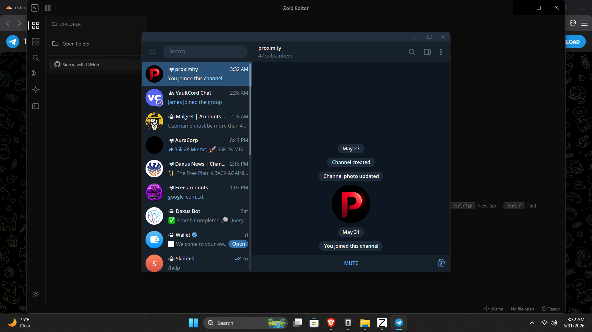

# Zoid Editor

A free, open-source code editor with native AI integration, VS Code extension support, real Git workflows, and a glassmorphism interface — built with Electron, React, and Monaco Editor.


## Features

- **Monaco Editor** — Full IntelliSense, syntax highlighting, multi-cursor, and code folding for every language
- **AI-Powered** — Chat with multiple AI models simultaneously. Bring your own key (OpenAI, Anthropic, Google) or use free models via OpenRouter. Auto-detects local Ollama and LM Studio instances
- **Real Terminal** — Integrated xterm.js terminal connected to your system shell (PowerShell/cmd on Windows, bash on Linux/macOS)
- **VS Code Extensions** — Browse and install extensions from the Open VSX registry directly within the editor
- **Git Integration** — Full Git workflow: stage, commit, branch, checkout, push, pull, diff — all from the built-in source control panel
- **Glassmorphism UI** — Black & white glassmorphism design with dark/light mode toggle, custom title bar overlay, and smooth animations
- **Keyboard-Centric** — Command Palette (Ctrl+Shift+P), Ctrl+Tab navigation, and keyboard shortcuts for every action
- **BYOK** — Bring Your Own Key for premium AI models, plus free OpenRouter and local model support

## Download

| Platform | Download |
|----------|----------|
| Windows 10/11 (64-bit) | [Download .exe](https://github.com/itriedcoding/ZoidEditor/releases/download/v1.0.0/Zoid.Editor-Setup-1.0.0.exe) (106 MB) |
| macOS | Coming soon |
| Linux | Coming soon |

## Getting Started

### Prerequisites

- **Windows 10/11** (64-bit) — other platforms coming soon
- For AI features: an API key from [OpenAI](https://platform.openai.com), [Anthropic](https://console.anthropic.com), or [Google AI](https://makersuite.google.com), or install [Ollama](https://ollama.ai) / [LM Studio](https://lmstudio.ai) locally

### Installation

1. Download the latest installer from the [Releases page](https://github.com/itriedcoding/ZoidEditor/releases)
2. Run the installer and follow the setup wizard
3. Launch Zoid Editor

### Building from Source

```bash
git clone https://github.com/itriedcoding/ZoidEditor.git
cd ZoidEditor
npm install
npm run dev          # Development mode with hot reload
npm run electron:pack   # Package for testing (unpacked)
npm run electron:build  # Build installer (NSIS)
```
## Tech Stack

| Layer | Technology |
|-------|-----------|
| Editor | Monaco Editor |
| Frontend | React 18, TypeScript, Vite |
| Desktop | Electron 31 |
| Terminal | xterm.js + xterm-addon-fit |
| Styling | Glassmorphism CSS (custom) |
| AI SDK | OpenAI, Anthropic, Google Generative AI |
| Git | simple-git |
| Extensions | Open VSX API |
| State | Zustand |
| Build | electron-builder (NSIS) |

## Architecture

```
ZoidEditor/
├── electron/          # Electron main process
│   ├── main.cjs       # Window management, IPC handlers, terminal, git
│   └── preload.cjs    # Context bridge (IPC exposure)
├── src/               # React renderer
│   ├── components/    # UI components (Editor, Terminal, Sidebar, etc.)
│   ├── services/      # AI, GitHub, extensions, local detection
│   ├── store/         # Zustand state management
│   └── styles/        # Theme CSS
├── scripts/           # Build & utility scripts
├── website/           # Marketing website (Vercel)
└── public/            # Static assets
```

## Screenshots



*Zoid Editor with the glassmorphism dark theme, file tree sidebar, and integrated terminal.*

## License

MIT — see LICENSE for details.

Not affiliated with Microsoft or VS Code.
